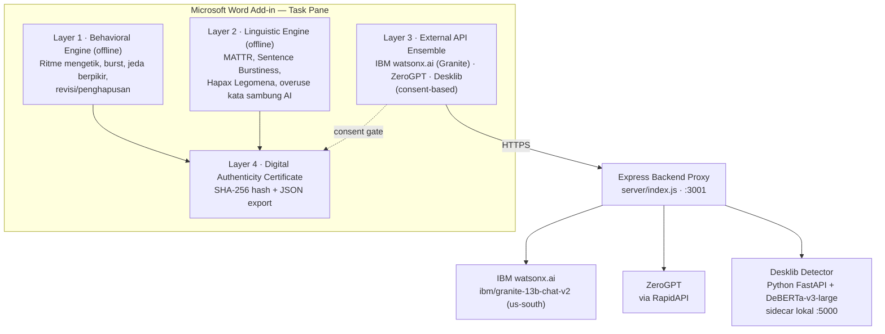

<div align="center">

# 🛡️ Creative Alibi v2.0
### The "Proof of Human Effort" Protocol

**Digital notary & Microsoft Word Add-in yang membuktikan secara matematis bahwa sebuah karya tulis dibuat oleh manusia — dibangun untuk IBM AI Builders Challenge, tema "Reimagine Creative Industries with AI".**

[](https://ai-alibi-cccxvdhsdfskhhvbu8ushj.streamlit.app/)
[](https://www.ibm.com/watsonx)
[](https://www.microsoft.com/microsoft-365/word)
[](./LICENSE)

</div>

---

## 🔗 Quick Links

| Komponen | Link | Keterangan |
|---|---|---|
| 🎈 **Streamlit Web App (Live)** | [ai-alibi-cccxvdhsdfskhhvbu8ushj.streamlit.app](https://ai-alibi-cccxvdhsdfskhhvbu8ushj.streamlit.app/) | UI web interaktif — verifikasi teks & generate sertifikat tanpa install apapun |
| 📄 **Word Add-in Manifest** | [`manifest.xml`](manifest.xml) | File manifest Office 365 untuk sideloading di Microsoft Word |
| 💻 **Express Backend Proxy** | `http://localhost:3001` | Proxy server lokal (`npm run start-server`) |
| 🤖 **Telegram Support Bot** | `@Creativealibi_bot` | Bantuan instalasi & troubleshooting via DeepSeek/OpenRouter |

---

## ⚖️ Kenapa Project Ini Dibuat

> **"Proof of human effort, not detection of AI."**

Ledakan generative AI menciptakan **krisis keaslian** di industri kreatif — penulis, jurnalis, dan mahasiswa dituduh memakai AI tanpa bukti nyata, sementara AI-detector konvensional punya *false-positive rate* tinggi (terutama untuk penulis non-native English) dan hanya menganalisis teks *hasil akhir* — sama sekali melewatkan proses penciptaannya, sekaligus berisiko membocorkan IP karena teks penuh harus diupload ke server pihak ketiga.

Creative Alibi membalik paradigma itu: alih-alih bertanya *"apakah ini dibuat AI?"*, sistem ini membuktikan **manusia menciptakan ini melalui proses yang terekam dan terverifikasi.**

## 🎯 Untuk Siapa

| Persona | Masalah | Solusi |
|---|---|---|
| ✍️ **Freelance Writer** | Klien menuduh pakai AI setelah artikel dikirim | Sertifikat forensik sebagai lampiran bukti-proses di invoice |
| 🎓 **Mahasiswa** | Detector AI dosen menandai skripsi sebagai AI-generated | Sertifikat berisi ritme mengetik & pola linguistik alami |
| 📰 **Jurnalis** | Editor mempertanyakan keaslian tulisan investigasi | Sertifikat dengan hash SHA-256 yang bisa diverifikasi siapa saja |
| 📚 **Publisher** | Perlu verifikasi asal-usul naskah tanpa membaca konten mentah | Wajibkan sertifikat Creative Alibi saat submission |

## 🏛️ Arsitektur Deteksi Multi-Layer



1. **Layer 1 — Behavioral Engine (Offline/Lokal):** menganalisis ritme mengetik, lonjakan input (*burst*), jeda berpikir alami, dan statistik revisi/penghapusan.
2. **Layer 2 — Linguistic Engine (Offline/Lokal):** mengukur keanekaragaman kata (MATTR), variasi panjang kalimat (*burstiness*), rasio kata unik (*hapax legomena*), dan pengulangan kata penghubung khas AI.
3. **Layer 3 — External API Ensemble Verification:** terintegrasi dengan **IBM watsonx.ai** (Granite Model `ibm/granite-13b-chat-v2`), **ZeroGPT** (RapidAPI), dan **Desklib** (DeBERTa-v3-large, self-hosted sidecar) — hanya aktif dengan consent eksplisit dari pengguna.
4. **Layer 4 — Digital Authenticity Certificate:** sertifikat bukti forensik ber-hash SHA-256, dapat diunduh sebagai JSON atau disisipkan langsung ke dokumen Word.

### Status Integrasi Provider Layer 3

| Provider | Status | Model / Platform | Keterangan |
|---|---|---|---|
| **IBM watsonx.ai** | 🟢 Aktif & Verified | `ibm/granite-13b-chat-v2` (`us-south`) | Terhubung via IAM Token & Project |
| **ZeroGPT** | 🟢 Aktif & Verified | RapidAPI Engine | Terhubung via RapidAPI Proxy Key |
| **Desklib** | 🟢 Aktif | DeBERTa-v3-large (`:5000`) | Self-hosted local sidecar detector |
| **GPTZero** | ⬜ Opsional | Proprietary | Perlu API key sendiri |
| **HIX** | ⬜ Opsional | AI Bypass Premium | Perlu akun premium |

## ✨ Fitur Utama

- 🎬 **Recording Session** — start/pause/stop dengan Human Rhythm Score real-time
- 📊 **Forensic Dashboard** — skor gabungan multi-layer + breakdown per layer
- 📜 **Sertifikat Digital** — JSON ber-hash SHA-256, bisa diunduh atau disisipkan ke dokumen
- 🔑 **Sistem Lisensi/Aktivasi** — endpoint aktivasi kode lisensi (`/api/license/activate`) dengan penyimpanan di Google Cloud Storage, plus panel admin untuk generate lisensi
- 🤖 **Telegram Support Bot** (`@Creativealibi_bot`) — bantuan instalasi berbasis DeepSeek/OpenRouter, dibatasi daftar user yang diizinkan
- 🔐 **Google OAuth** (opsional) — login untuk fitur/dashboard tertentu
- 🌐 **Streamlit Web App** — alternatif tanpa install, langsung tempel teks dan analisis

## 🧱 Tech Stack

| Layer | Teknologi |
|---|---|
| Add-in Frontend | Office.js Word Task Pane (`taskpane.html/css/js`, `forensic-engine.js`, `linguistic-engine.js`, `api-detector.js`) |
| Backend Proxy | Node.js + Express (`server/index.js`), Helmet, express-rate-limit, express-session, Passport (Google OAuth) |
| Detector Sidecar | Python + FastAPI (`server/detector/`), model DeBERTa-v3-large |
| Storage Lisensi | Google Cloud Storage (`@google-cloud/storage`) |
| Bundler | Webpack 5 (`webpack.config.js`) |
| Web App Alternatif | Streamlit (`streamlit_app.py`) |
| Support Bot | Telegram Bot API + OpenRouter (DeepSeek) |

## 📖 Cara Pakai (3 Opsi Akses)

### Opsi 1 — Streamlit Web App (tanpa install apapun)
1. Buka [ai-alibi-cccxvdhsdfskhhvbu8ushj.streamlit.app](https://ai-alibi-cccxvdhsdfskhhvbu8ushj.streamlit.app/)
2. Tempel teks tulisan (minimal 50 kata)
3. Klik **🔍 Jalankan Analisis Multi-Layer**
4. Lihat **Forensic Confidence Score** dan unduh sertifikat JSON

### Opsi 2 — Microsoft Word Add-in (sideload lokal)
```bash
git clone https://github.com/indri007/ai-alibi.git
cd ai-alibi
npm install
npm run start-server   # Backend proxy di http://localhost:3001
npm run dev-server      # Webpack UI di https://localhost:3000
```
Lalu di Word: **Insert → Get Add-ins → Upload My Add-in** → pilih `manifest.xml` dari folder repo.

### Opsi 3 — Mode Developer Lengkap
```bash
git clone https://github.com/indri007/ai-alibi.git
cd ai-alibi
npm install

npm run start-server   # Express Proxy Server (port 3001)
npm run dev-server      # Webpack Dev Server untuk Add-in (port 3000)

# Opsional: jalankan juga versi Streamlit
streamlit run streamlit_app.py
```

### Konfigurasi IBM watsonx.ai (opsional, direkomendasikan)
1. Salin `server/.env.example` menjadi `server/.env`
2. Isi `WATSONX_API_KEY` dan `WATSONX_PROJECT_ID` (daftar di [cloud.ibm.com](https://cloud.ibm.com/))
3. Di Word: buka panel Creative Alibi → **Settings ⚙️** → aktifkan **Layer 3** → pilih **IBM watsonx.ai (Granite)**

## 🧪 Contoh Request API (CLI)

```bash
curl -X POST http://localhost:3001/api/detect \
  -H "Content-Type: application/json" \
  -d '{
    "provider": "watsonx",
    "text": "Penelitian ini menganalisis bukti forensik ritme penulisan dan distribusi frekuensi kata alami manusia."
  }'
```

## 🌐 Environment Variables (`server/.env`)

| Variabel | Wajib | Default | Keterangan |
|---|---|---|---|
| `PORT` | Tidak | 3001 | Port Express server |
| `DESKLIB_URL` | Ya* | `http://127.0.0.1:5000` | URL sidecar Desklib (lokal/Cloud Run) |
| `DESKLIB_TIMEOUT_MS` | Tidak | 60000 | Timeout request ke Desklib |
| `WATSONX_API_KEY` / `WATSONX_PROJECT_ID` | Tidak | – | Kredensial IBM watsonx.ai |
| `WATSONX_REGION` | Tidak | `us-south` | Region IBM Cloud |
| `GPTZERO_API_KEY` / `ZEROGPT_API_KEY` | Tidak | – | API key provider opsional |
| `HIX_EMAIL` / `HIX_PASSWORD` | Tidak | – | Akun premium HIX Bypass |
| `API_KEY` | Tidak | – | Auth header `X-API-Key` untuk proxy publik |
| `RATE_LIMIT_MAX` | Tidak | 20 | Request/menit per IP |
| `GOOGLE_CLIENT_ID` / `GOOGLE_CLIENT_SECRET` / `SESSION_SECRET` | Tidak | – | Google OAuth login (opsional) |
| `ADMIN_PASSWORD` | Ya (untuk admin) | – | Header `X-Admin-Password` untuk generate lisensi |
| `TELEGRAM_BOT_TOKEN` / `OPENROUTER_API_KEY` | Tidak | – | Untuk bot Telegram support |

## 🛠️ Struktur Project

```
ai-alibi/
├── streamlit_app.py         # Streamlit Live Web App
├── manifest.xml              # Word Add-in Manifest (Office 365)
├── package.json
├── server/
│   ├── index.js               # Express Proxy Server entry point
│   ├── routes/
│   │   ├── detect.js           # /api/detect
│   │   ├── support.js          # /api/support
│   │   ├── auth.js             # Google OAuth (/auth/google, /api/me)
│   │   └── admin.js            # Rate limit ketat + mount license-routes
│   ├── providers/
│   │   ├── watsonx.js  ├── zerogpt.js  ├── desklib.js
│   │   ├── gptzero.js  └── hix.js
│   ├── detector/               # Python FastAPI sidecar (DeBERTa-v3-large)
│   │   ├── app.py  ├── model.py  ├── download_model.py  └── healthcheck.py
│   ├── lib/
│   │   ├── licenses.js         # Sistem lisensi (Google Cloud Storage)
│   │   ├── healthChecks.js  └── mailer.js
│   ├── bot/index.js            # Telegram Support Bot
│   └── license-routes.js       # /api/license/activate, /api/admin/generate-license
├── src/taskpane/
│   ├── taskpane.html/css/js    # UI & controller Add-in
│   ├── forensic-engine.js      # Scoring multi-layer & payload sertifikat
│   ├── linguistic-engine.js    # Kalkulator Zipf & MATTR offline
│   └── api-detector.js         # Handler API sisi frontend
└── docs/
    ├── PRD.md  ├── ERD.md  ├── WORKFLOW.md
    └── DOCUMENTATION.id.md / .en.md
```

## 👥 Tim

| Nama | Peran |
|---|---|
| **Indri Anjar Kartika Sari** | Product & Development |
| **Raja Chairul Wydmann** | Development |

## 📜 Lisensi

MIT License — lihat [LICENSE](./LICENSE) untuk detail.

---

<div align="center">
<sub>Creative Alibi v2.0.0 · Dibangun untuk IBM AI Builders Challenge</sub>
</div>
